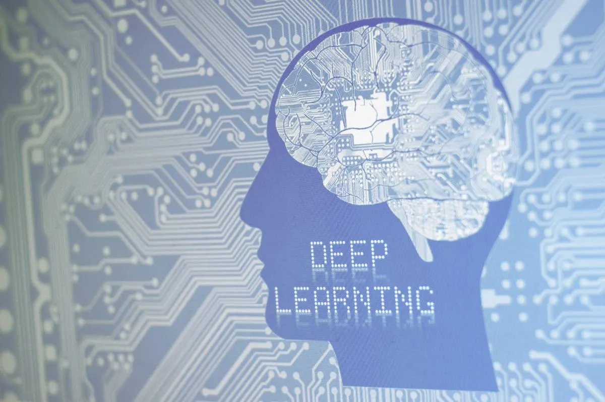

# Derin Öğrenme (Deep Learning) Dersi README

Bu GitHub deposu, "Derin Öğrenme" dersi için materyalleri içermektedir. Bu ders, temel derin öğrenme kavramlarını ve uygulamalarını öğretmek amacıyla tasarlanmıştır. Ders boyunca, öğrenciler derin öğrenmenin temellerini anlayacaklar ve farklı projelerde bu becerileri uygulayacaklardır.

## Ders İçeriği

### Hafta 1: Giriş ve Temel Kavramlar

- Yapay Zekâ tanımı ve önemi
- Makine Öğrenmesi tanımı ve amaçları
- Makine Öğrenmesi ve Derin Öğrenme Uygulamaları için Gereksinimler
- Regresyon Modelleri Anlatımı ve Uygulaması
- Örnek Uygulama - [Week #1 - YAZ20411_Linear_Regression_Models.ipynb](Week%20%231/YAZ20411_Linear_Regression_Models.ipynb)

### Hafta 2: Decision Tree, Random Forest ve Support Vector Regresyonu

### Hafta 3: 

## Gereksinimler

- Python 3.7 veya üzeri
- Sklearn, TensorFlow gibi derin öğrenme kütüphaneleri
- Jupyter Notebook veya Google Colab
- Veri kümesi (örnekler, görüntüler, metin, vb.)

## Örnek Kod ve Projeler

Her haftanın sonunda, o haftanın içeriğine uygun örnek kodlar ve projeler bu depoda bulunacak ve bu README.md dosyasına eklenecektir. Kodları çalıştırmak ve projeleri incelemek için yönergeleri izleyin.

## Kaynaklar

Bu dersi daha derinlemesine anlamak ve geliştirmek için aşağıdaki kaynakları kullanabilirsiniz:

- "Derin Öğrenme" (Deep Learning) kitapları
- İnternet üzerindeki derin öğrenme eğitim kaynakları ve dökümantasyonlar

## İletişim

Dersle ilgili herhangi bir soru veya geri bildirim için lütfen bana e-posta ile ulaşın: [fatihbal@klu.edu.tr](mailto:e-posta_adresiniz@example.com)

## Lisans ve Katkıda Bulunma

Bu proje [MIT Lisansı](LICENSE) altında lisanslanmıştır. Katkıda bulunmak isterseniz, lütfen katkıda bulunma rehberimize bakın.

---
Bu README.md dosyası, ders materyallerini ve kaynakları düzenli ve erişilebilir bir şekilde sunmak için tasarlanmıştır. Ders boyunca bu dosya güncellenecektir. İyi çalışmalar!